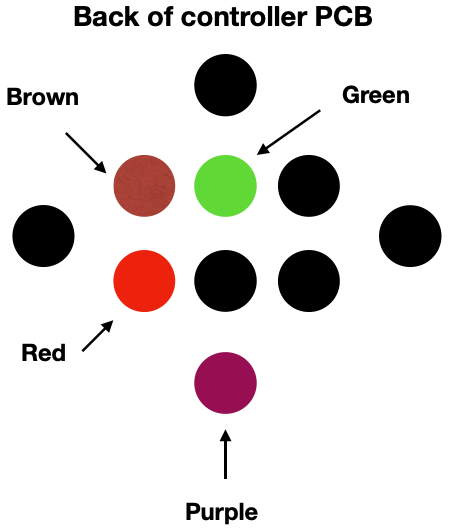

# GC-Internal-WaveBird

This repo contains a diagram to hard wire a GameCube WaveBird controller to the console.

Why would you want to do that? To hide the receiver inside the console

# Install

Remove the PCB from the receiver.

Clip off the controller connector (clip near the connector (the one that plugs into the GC), so you have more wire to work with)

Extend the wires to the points shown in the picture.

Take note of the channel setting on the receiver before hiding it in the console.

## Can I still use a wired controller if I do this mod?

Yes, just plug the wired controller into the GC like normal.

## Will using a wired controller hurt my GC?

No, using both a wired controller and a WaveBird at the same time will be similar to using two WaveBirds on the same channel. 
